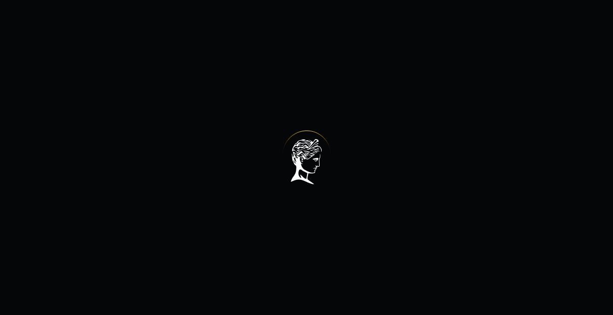

# achilles

<p align="center" >



</p>
<p align="center">
    
</p>

## 🧪 Technologies

This project was developed using the following technologies:

- [ReactJS](https://reactjs.org/)
- [Styled Components](https://styled-components.com/)


## 🚀 Getting started

Clone the project and access the folder.

Run this command to install the dependencies.

```bash
git clone https://github.com/eziiel/achilles.git

cd achilles

npm install

npm run dev
```

## 🔖 Layout

You can view the project through the links below:

- [Live Preview](#)

- [Figma](https://www.figma.com/file/9QCh4nzuGN5wFuvdQQfnEN/Orpheus---Designer-Portfolio-(%2B-Sculpture-Avatars)-(Community)?node-id=0%3A1)

Remembering that you need to have a [Figma](http://figma.com/) account to access it.

## 📝 License

This project is licensed under the MIT License. See the [LICENSE](https://opensource.org/licenses/MIT) file for details.


<br>
<br>
<br>


Made with 💜 by [eziiel](https://github.com/eziiel) 🙌🚀


